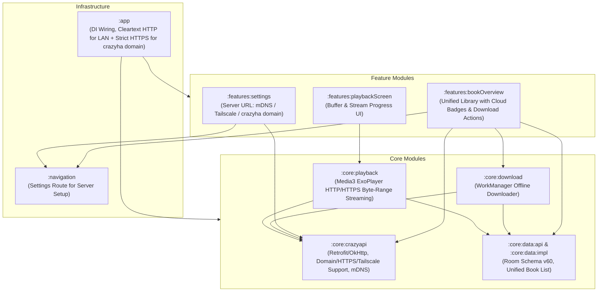

# Crazy Audiobook Creator Integration Plan for Voice (Android)

## 1. Executive Summary

This document specifies the technical plan to integrate the **Voice Audiobook Player** (Android) with **Crazy Audiobook Creator** (FastAPI backend).

### Core Objectives
1. **Unified Library with Direct Remote Streaming**: Remote audiobooks from Crazy Audiobook Creator appear seamlessly in the main Voice library (`BookOverview`) tagged with a cloud/stream badge. Users can tap to start playing immediately over HTTP/HTTPS (via local Wi-Fi, Tailscale, or `crazyha` subdomain).
2. **In-Progress / Chapter-by-Chapter Playback**: Stream mastered `.wav` chapters directly for in-production books as chapters finish without waiting for full `.m4b` export.
3. **One-Tap Offline Download**: Download full `.m4b` files or chapter `.wav` files to device storage for offline playback, with automatic seamless switching to the local file once downloaded.
4. **Flexible Connectivity**:
   - **Local Wi-Fi**: Auto-discovery via mDNS / Zeroconf (`_crazy-audiobook._tcp`).
   - **Internet / Remote**: Direct URL support for `crazyha` domain / reverse proxy (HTTPS) or Tailscale mesh IP.
5. **Bidirectional Progress Sync**: Maintain listening position sync between the mobile device and server.

---

## 2. Architecture & Unified Library Design

Voice follows a clean unidirectional modular architecture:
```
Infrastructure (:app, :navigation) → Core (:core:*) → Features (:features:*)
```



---

## 3. Streaming Engine (Media3 & ExoPlayer)

### 3.1 Streaming Formats
- **Completed Audiobooks**: Stream packaged `.m4b` container with embedded chapter marks over HTTP/HTTPS.
- **In-Progress Audiobooks**: Stream individual mastered chapter `.wav` files directly (`/api/projects/{id}/download/chapter/{num}`).
- **Seeking & Range Requests**: Media3 ExoPlayer uses standard `Range: bytes=start-end` headers for zero-lag seeking within remote audio files.

### 3.2 Network Data Source Configuration
In `PlaybackModule.kt`, configure `DefaultHttpDataSource.Factory`:
- Custom User-Agent: `VoiceAudiobookPlayer/<version>`
- Support for HTTP cleartext (local LAN / Tailscale) and HTTPS (`crazyha` domain).
- Connection timeout: 15s; Read timeout: 30s.
- `DefaultLoadControl` tuned for audio:
  - Min buffer: 15s, Max buffer: 90s, Buffer for playback start: 2s.

---

## 4. Offline Download Manager

### 4.1 Storage & Organization
Files are saved to app-scoped storage:
`context.getExternalFilesDir(Environment.DIRECTORY_PODCASTS)/crazy_audiobooks/<project_id>/`
- Clean uninstallation automatically cleans up audio files.
- Downloads are executed via Android **WorkManager** (`AudiobookDownloadWorker`) with background support, pause/resume on network loss, and system download notifications.

### 4.2 Seamless Local Transition
When a remote book download completes:
1. `BookContent` in Room updates: `isDownloaded = true`, and chapter URIs point to local `file:///...` paths.
2. Active playback continues uninterrupted, reading from the local file upon the next buffer/chapter transition.

---

## 5. Unified Library Integration (`:features:bookOverview`)

### 5.1 UI Presentation (Option B: Unified Library)
All books appear together in `BookOverview`:
- **Local Device Books**: Normal card/list item.
- **Remote Server Books**:
  - **Cloud Icon Badge**: Indicating the book is hosted on Crazy Audiobook Creator.
  - **In-Progress Status Indicator**: For books still generating (e.g. `Generating • Ch 4/12`).
  - **Download Button**: One-tap action on the book card or bottom sheet to download for offline use.
  - **Download Progress Indicator**: Circular progress indicator while downloading.
  - **Downloaded Checkmark**: Indicates the book is stored locally.

### 5.2 Filter & Sort Options
The library category bar or filter menu includes:
- `All Books`
- `Downloaded / Local`
- `Crazy Audiobooks (Remote)`

---

## 6. Connectivity & Discovery (`:core:crazyapi`)

### 6.1 Supported Connection Modes
1. **Local Wi-Fi (mDNS / Zeroconf)**: Auto-discovers workstations running `_crazy-audiobook._tcp` with one tap.
2. **Tailscale VPN**: Direct connection to Tailscale IP/MagicDNS (e.g. `http://100.x.y.z:8000`).
3. **Internet / Subdomain (`crazyha`)**: Full HTTPS support (e.g. `https://audio.crazyha.example.com`).

### 6.2 Settings Screen (`:features:settings`)
- **Server Address**: Accepts `http://192.168.x.x:8000`, `http://100.x.y.z:8000`, or `https://subdomain.crazyha...`.
- **Auto-Discovery Button**: Quick LAN scan using Android `NsdManager`.
- **Connection Status Banner**: Shows latency, server version, and active book count.

---

## 7. Data Models & Room Schema (v60)

```kotlin
@Entity(tableName = "content2")
public data class BookContent(
  @PrimaryKey val id: BookId,
  val playbackSpeed: Float,
  val skipSilence: Boolean,
  val isActive: Boolean,
  val lastPlayedAt: Instant,
  val author: String?,
  val name: String,
  val addedAt: Instant,
  val chapters: List<ChapterId>,
  val currentChapter: ChapterId,
  val positionInChapter: Long,
  val cover: File?,
  @ColumnInfo(defaultValue = "0") val gain: Float,
  val genre: String?,
  val narrator: String?,
  val series: String?,
  val part: String?,
  // Remote / Crazy Audiobook Creator metadata
  @ColumnInfo(defaultValue = "NULL") val remoteProjectId: String? = null,
  @ColumnInfo(defaultValue = "0") val isRemoteStream: Boolean = false,
  @ColumnInfo(defaultValue = "0") val isDownloaded: Boolean = false,
  @ColumnInfo(defaultValue = "NULL") val remoteStreamUrl: String? = null,
  @ColumnInfo(defaultValue = "NULL") val remoteStatus: String? = null, // "ready_full", "in_progress"
)
```

---

## 8. Implementation Steps

1. **Phase 1: Networking & Discovery (`:core:crazyapi`)**:
   - Implement Retrofit client, OkHttp with HTTPS & HTTP support, and `NsdManager` mDNS discovery.
2. **Phase 2: Database & Unified Library Sync (`:core:data`)**:
   - Room migration (v59 -> v60) with `isRemoteStream` and `isDownloaded` fields.
   - Sync remote catalog into Room so remote books appear directly in `BookOverview`.
3. **Phase 3: Media3 ExoPlayer HTTP Streaming (`:core:playback`)**:
   - Inject configured `DefaultHttpDataSource.Factory` into `PlaybackModule.kt`.
   - Verify byte-range streaming for both `.m4b` and chapter `.wav` files.
4. **Phase 4: WorkManager Downloader (`:core:download`)**:
   - Implement background download worker with progress notifications and local file switching.
5. **Phase 5: UI Updates in `:features:bookOverview` & `:features:settings`**:
   - Add server connection configuration in Settings.
   - Add cloud badge, download action, and in-progress indicators to `BookOverview`.
6. **Phase 6: Verification & Tests**:
   - Automated unit tests for API client, DTOs, Room migration, and download worker.
   - Live testing with LAN, Tailscale, and HTTPS endpoints.
